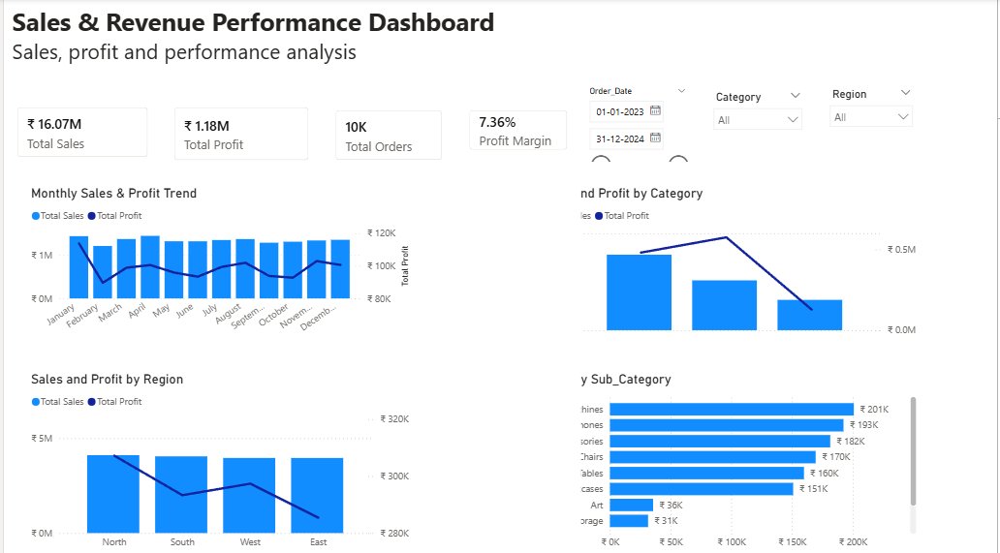

# Sales & Revenue Performance Analysis

## Project Overview

## Power BI Dashboard

This project analyzes sales, profit, customers, products, regions, cities, categories, sub-categories, and customer segments to identify key business performance trends and profitability drivers.

The project combines **PostgreSQL** for data analysis and **Power BI** for interactive dashboard development.

## Objectives

* Analyze overall sales and profit performance
* Identify high-value and high-profit customers
* Evaluate product and sub-category profitability
* Compare regional and city-level performance
* Analyze sales and profit across customer segments
* Identify areas with high sales but low profitability
* Build an interactive Power BI dashboard for business reporting

## Tools Used

* PostgreSQL
* SQL
* Power BI
* DAX
* GitHub

## SQL Analysis

The SQL analysis was performed using PostgreSQL to evaluate sales, profitability, customer performance, product performance, and regional trends.

### Key Analysis Areas

* Monthly sales and month-over-month performance
* Top customers by sales and profitability
* Average order value by customer
* Top-performing products by sales
* Product-level profit margin
* Regional sales and profitability
* Top cities by sales
* High-sales, low-margin cities
* Sub-category profitability
* Most profitable sub-category within each category
* Segment-level sales and profitability
* Lowest-profit customer segment by region

### SQL Concepts Used

* GROUP BY
* Aggregate functions such as `SUM()`, `COUNT()`
* COUNT(DISTINCT ...)
* ROUND()
* ORDER BY
* LIMIT
* Common Table Expressions (CTEs)
* Window functions
* RANK()
* PARTITION BY
* Conditional filtering

## Power BI Dashboard

An interactive Power BI dashboard was created to provide a consolidated view of sales and profitability performance.

### Dashboard Components

**KPI Cards**

* Total Sales
* Total Profit
* Total Orders
* Profit Margin

**Visual Analysis**

* Monthly Sales & Profit Trend
* Sales & Profit by Category
* Sales & Profit by Region
* Profit by Sub-category

**Interactive Filters**

* Date
* Category
* Region

The dashboard allows users to filter the analysis dynamically and evaluate how sales and profitability change across different time periods, categories, and regions.

## Business Questions

This project addresses questions such as:

* How are sales and profit trending over time?
* Which categories generate the most sales and profit?
* Which regions perform best?
* Which sub-categories have the strongest and weakest profitability?
* Which customers contribute the most revenue?
* Are there locations generating high sales but relatively low profit?
* Which customer segments contribute most to overall performance?

